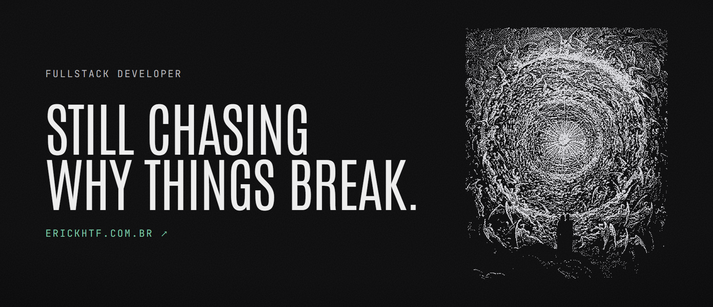
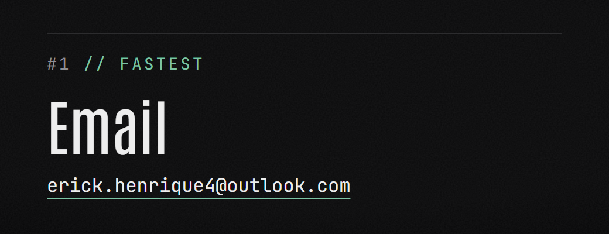
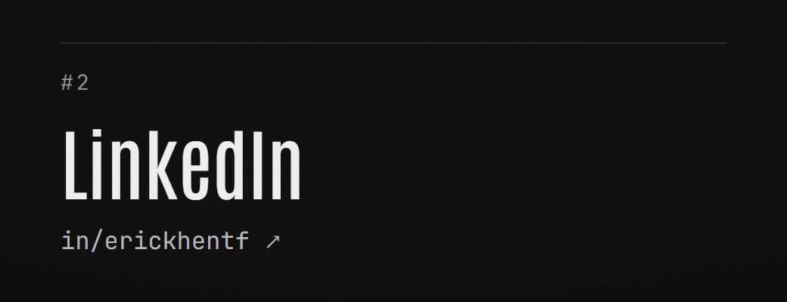

### `01` Stack

- **Java & Spring Boot**: RESTful APIs in production, from endpoint design to maintenance.
- **AWS & observability**: EC2, S3, RDS, IAM, SNS, SQS, ECS and ECR; distributed services monitored with New Relic APM.
- **SQL**: query writing and optimization in PostgreSQL and MySQL.
- **CI/CD**: pipelines with Jenkins and GitHub Actions; Docker for consistent environments.

